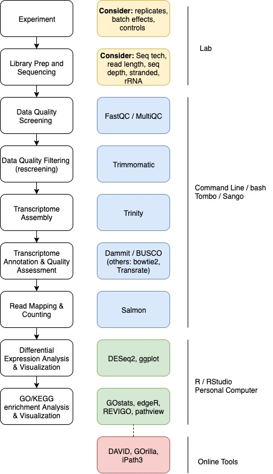

# RNA-seq Skill Pill
### OIST - December 4th, 5th, 11th, 12th, 2019
#### Taught by: Maggi Mars Brisbin

### Course Resources

Github: https://github.com/maggimars/rnaSkillPill/blob/master/RNA-seq.md

HackMd: https://hackmd.io/@maggi/RNA-Seq_SkillPill_Master

Stickies: Green = "everything is fine", Red = "I need some help"

### Overview

RNA-seq is a widely used and extremely useful tool in biology, especially when working with non-model organisms that do not have published genomes. RNA-seq refers to using next-generation/high-throughput sequencing to sequence the mRNA in cell or tissue samples in order to determine which genes are being more or less expressed in certain conditions. RNA-seq can, therefore, provide insight into physiological states and molecular pathways associated with phenotypes of interest. In this Skill Pill, we will cover RNA-seq data analysis, starting with raw reads and ending with functional analyses (applicable to model and non-model organisms).

**Workflow:**

#### Experiment and Library Prep Discussion

*experimental design: replicates, batch effects, controls*

How many biological replicates are needed in an RNA-seq experiment and which differential expression tool should you use?     
(Schurch et al. 2016)       
https://www.ncbi.nlm.nih.gov/pubmed/27022035

#### Data Quality Screening

First, we need to get some data to work with.

We will be working on Tombo, so login with ssh:
`ssh maggi-brisbin@tombo.oist.jp`       
(substitute maggi-brisbin for your user name, **not your email address**)

make a directory to work in for this course:
`mkdir RNAseq`

and move into your new directory:
`cd RNAseq`

make a directory for the raw data:
`mkdir yeast`

move into the directory for data:
`cd yeast`

Download yeast RNA-seq data from the open science framework:

    curl -L https://osf.io/5daup/download -o ERR458493.fastq.gz
    curl -L https://osf.io/8rvh5/download -o ERR458494.fastq.gz
    curl -L https://osf.io/2wvn3/download -o ERR458495.fastq.gz
    curl -L https://osf.io/xju4a/download -o ERR458500.fastq.gz
    curl -L https://osf.io/nmqe6/download -o ERR458501.fastq.gz
    curl -L https://osf.io/qfsze/download -o ERR458502.fastq.gz

These commands download gzipped fastq files and rename them.

##### Check sequencing data quality (Fastqc/Multiqc)

Fastqc is a tool that creates quality reports for sequencing data.        
https://www.bioinformatics.babraham.ac.uk/projects/fastqc/      

Multiqc is a tool that wraps up a whole bunch of fastqc reports into a single report.         
https://multiqc.info/

We will run **Fastqc** on our data files first:

make a slurm file to run fastqc on all of the data files: `nano fastqc.slurm`

    #!/bin/bash

    #SBATCH --job-name=fastqc
    #SBATCH --partition=compute
    #SBATCH --time=00:30:00
    #SBATCH --mem-per-cpu=1G
    #SBATCH --ntasks=1
    #SBATCH --mail-user=%u@oist.jp
    #SBATCH --mail-type=NONE
    #SBATCH --input=none
    #SBATCH --output=fastqc_%j.out
    #SBATCH --error=fastqc_%j.err

    module use /work/scratch/skillpill/.modulefiles
    module load RNA-seq/1.0

    fastqc ERR*.fastq.gz

control + o --> save    
control + x --> exit

*The module we load include several of the softwares that are needed for this course, but we will also install a few on our own later on.*

to run the slurm file: `sbatch fastqc.slurm`

After this job finishes running, there will be `fastqc.zip` and `fastqc.html` files in your data directory.

Secure copy one report to your local computer so that we can look at a report:    
open another terminal tab or window and `cd` to the directory you would like to move the fastqc to on your local computer. Then copy the report to your current working directory:    
`scp maggi-brisbin@tombo.oist.jp:/home/m/maggi-brisbin/RNAseq/yeast/ERR458493_fastqc.html .`

and to open the report:
`open ERR458493_fastqc.html`

Next, lets bundle up all of our fastqc reports into a single report with **Multiqc**:

Back in your tombo terminal, make a new slurm file to run Multiqc: `nano multiqc.slurm`

    #!/bin/bash

    #SBATCH --job-name=multiqc
    #SBATCH --partition=compute
    #SBATCH --time=00:30:00
    #SBATCH --mem-per-cpu=1G
    #SBATCH --ntasks=1
    #SBATCH --mail-user=%u@oist.jp
    #SBATCH --mail-type=NONE
    #SBATCH --input=none
    #SBATCH --output=multiqc_%j.out
    #SBATCH --error=multiqc_%j.err

    module use /work/scratch/skillpill/.modulefiles
    module load RNA-seq/1.0

    multiqc ERR*

to run the slurm file: `sbatch multiqc.slurm`

after this runs, you will have a new directory `multiqc_data` and a report `multiqc_report.html`

Again, we will move over the report for viewing on our local computer:
`scp maggi-brisbin@tombo.oist.jp:/home/m/maggi-brisbin/RNAseq/yeast/multiqc_report.html .`

and view the report: `open multiqc_report.html`

**Quality Trimming with Trimmomatic**    
http://www.usadellab.org/cms/?page=trimmomatic

back in tombo terminal, leave the raw data directory by moving up to the skill pill directory: `cd ..`

make a new directory for quality trimmed data: `mkdir yeast_trimmed`
move into the new directory: `cd yeast_trimmed`

we will need to get the adapter file:
`wget https://raw.githubusercontent.com/timflutre/trimmomatic/master/adapters/TruSeq2-SE.fa`

make a slurm file to quality trim the data with Trimmomatic: `nano trimmomatic.slurm`

    #!/bin/bash

    #SBATCH --job-name=trimmomatic
    #SBATCH --partition=compute
    #SBATCH --time=0:30:00
    #SBATCH --mem=1G
    #SBATCH --cpus-per-task=1
    #SBATCH --nodes=1
    #SBATCH --mail-type=NONE
    #SBATCH --input=none
    #SBATCH --output=trim_%j.out
    #SBATCH --error=trim_%j.err
    #SBATCH --array 493,494,495,500,501,502

    module use /work/scratch/skillpill/.modulefiles
    module load RNA-seq/1.0

    trimmomatic SE ./../yeast/ERR458${SLURM_ARRAY_TASK_ID}.fastq.gz \
    ERR${SLURM_ARRAY_TASK_ID}.qc.fastq.gz \
    ILLUMINACLIP:TruSeq2-SE.fa:2:0:15 \
    LEADING:2 TRAILING:2 \
    SLIDINGWINDOW:4:2 \
    MINLEN:25

and run the slurm file `sbatch trimmomatic.slurm`

As output, we will get new files for each sample, such as `ERR493.qc.fastq`, and in the log files for each sample we can see how many of our sequences were discarded.

SO lets see if our quality reports have changed at all: `quality.slurm`

    #!/bin/bash

    #SBATCH --job-name=fastqc
    #SBATCH --partition=compute
    #SBATCH --time=00:30:00
    #SBATCH --mem-per-cpu=1G
    #SBATCH --ntasks=1
    #SBATCH --mail-user=%u@oist.jp
    #SBATCH --mail-type=NONE
    #SBATCH --input=none
    #SBATCH --output=fastqc_%j.out
    #SBATCH --error=fastqc_%j.err

    module use /work/scratch/skillpill/.modulefiles
    module load RNA-seq/1.0

    fastqc ERR*.fastq.gz

    multiqc ./ERR*

run the slurm file     
rename the multiqc report: `mv multiqc_report.html multiqc_report_trimmed.html`

Secure copy the new multiqc report to your local comp and open it.

Did anything change? Why or why not?

#### Assemble the transcriptome with Trinity

Why might it be a good idea to use an assembly from your data as a reference instead of a previously published reference transcriptome or genome?

https://github.com/trinityrnaseq/trinityrnaseq/wiki

**download and install trinity:**

move up into the skillpill directory: `cd ..`    
(double check you're in the right place `pwd`)

`wget https://github.com/trinityrnaseq/trinityrnaseq/releases/download/v2.8.6/trinityrnaseq-v2.8.6.FULL.tar.gz`   

load cmake module (required to install trinity): `module load cmake`

unpack the trinity tarball: `tar -xzf trinityrnaseq-v2.8.6.FULL.tar.gz`

move into the trinity directory: `cd trinityrnaseq-v2.8.6/`

install trinity: `make`

install trinity plugins `make plugins`

**download and install trinity dependencies:**    
*Jellyfish*   
https://github.com/gmarcais/Jellyfish

download:
`wget https://github.com/gmarcais/Jellyfish/releases/download/v2.3.0/jellyfish-2.3.0.tar.gz
`

unpack: `tar -xzf jellyfish-2.3.0.tar.gz`

move into jellyfish directory: `cd jellyfish-2.3.0`

install:    

    ./configure --prefix=$HOME
    make -j 4
    make install

*Salmon*    
https://combine-lab.github.io/salmon/getting_started/

download: `wget https://github.com/COMBINE-lab/salmon/releases/download/v1.0.0/salmon-1.0.0_linux_x86_64.tar.gz`    
unpack: `tar -xzf salmon-1.0.0_linux_x86_64.tar.gz`   

**Add new software to our paths**   
now we will need to add the paths to trinity and its dependencies to our `.bashrc`

`nano ~/.bashrc` will open up your `.bashrc` file

add:

    export PATH=$PATH:/home/m/maggi-brisbin/RNAseq/trinityrnaseq-v2.8.6/
    export PATH=$PATH:/home/m/maggi-brisbin/RNAseq/jellyfish-2.3.0
    export PATH=$PATH:/home/m/maggi-brisbin/RNAseq/salmon-latest_linux_x86_64/bin

*but change the username*

ctrl + o --> save     
ctrl + x --> experiment

NOW we can run trinity and assemble a transcriptome.

well... almost ....

if we ran trinity on our quality trimmed files right now it would throw an error.

Take a look at the head of one of your file `ERR493.qc.fastq.gz` and see if you can spot the problem:

*to look at a zipped file:*
 `gzip -cd ERR493.qc.fastq.gz | head`

---------

Fixing fastq headers in yeast dataset:

first unzip the files: `gunzip *.qc.fastq.gz`

then use a for loop to replace the spaces from the fastq headers with an underscore:

    for filename in *.fastq
    do
    name=$(basename ${filename} .fastq)
    tr ' ' '_' <${name}.fastq >${name}.fq
    done

`tr` *stands for translate and is used for deleting or changing characters*

--------

Run Trinity (finally)

move up one directory: `cd ..`

make a directory for the trinity results: `mkdir yeast_trinity`

move into the trinity directory: `cd yeast_trinity`

make a slurm file to run trinity: 'nano trinity.slurm'

    #!/bin/bash

    #SBATCH --job-name=trinity
    #SBATCH --partition=compute
    #SBATCH --time=2:00:00
    #SBATCH --mem=12G
    #SBATCH --cpus-per-task=12
    #SBATCH --nodes=1
    #SBATCH --mail-user=%u@oist.jp
    #SBATCH --mail-type=NONE
    #SBATCH --input=none
    #SBATCH --output=trinity_%j.out
    #SBATCH --error=trinity_%j.err

    . $HOME/.bashrc
    module load samtools/1.3.1
    module load bowtie2/2.2.6
    DATA=/home/m/maggi-brisbin/RNAseq/yeast_trimmed

    Trinity --seqType fq --max_memory 10G  \
    --single $DATA/ERR493.qc.fq,$DATA/ERR494.qc.fq,$DATA/ERR495.qc.fq,$DATA/ERR500.qc.fq,$DATA/ERR501.qc.fq,$DATA/ERR502.qc.fq \
    --CPU 12

*change path for your trimmed data*

this should take about 30 mins to run will output a new directory called `trinty_out_dir` that will contain your new transcriptome assembly as `Trinity.fasta`

**Discussion:** How can you tell if your assembly is a good assembly?

https://github.com/trinityrnaseq/trinityrnaseq/wiki/Transcriptome-Assembly-Quality-Assessment

What is N50? https://www.molecularecologist.com/2017/03/whats-n50/

Does it matter for transcriptomes?
https://www.molecularecologist.com/2017/05/n50-for-transcriptome-assemblies/

---------
#### Transcriptome Annotation and Quality Assessment with Dammit
http://dib-lab.github.io/dammit/

download dammit annotation databases    
https://dammit.readthedocs.io/en/refactor-1.0/databases.html

move back to the skillpill directory: `cd ..`

make a new directory for dammit databases: `mkdir dammit_db`

move into new directory: `cd dammit_db`

make a slurm file for downloading dammit databases: `nano dammit_db.slurm`

    #!/bin/bash

    #SBATCH --job-name=dammitDB
    #SBATCH --partition=compute
    #SBATCH --time=6:00:00
    #SBATCH --mem=12G
    #SBATCH --cpus-per-task=12
    #SBATCH --nodes=1
    #SBATCH --mail-user=%u@oist.jp
    #SBATCH --mail-type=NONE
    #SBATCH --input=none
    #SBATCH --output=dammitDB_%j.out
    #SBATCH --error=dammitDB_%j.err

    module use /work/scratch/skillpill/.modulefiles
    module load RNA-seq/1.0

    dammit databases --install --database-dir /home/m/maggi-brisbin/RNAseq/dammit_db --busco-group eukaryota
*remember to change the user name*

run this slurm file

Annotate your transcriptome assembly:

`cd ..` to your RNAseq directory    
`mkdir yeast_dammit` and `cd yeast_dammit`

make a slurm file for running the annotation: `nano dammit.slurm`

    #!/bin/bash

    #SBATCH --job-name=dammit
    #SBATCH --partition=compute
    #SBATCH --time=6:30:00
    #SBATCH --mem=12G
    #SBATCH --cpus-per-task=12
    #SBATCH --nodes=1
    #SBATCH --mail-user=%u@oist.jp
    #SBATCH --mail-type=END
    #SBATCH --input=none
    #SBATCH --output=dammit_%j.out
    #SBATCH --error=dammit_%j.err

    module use /work/scratch/skillpill/.modulefiles
    module load RNA-seq/1.0

    dammit annotate /home/m/maggi-brisbin/RNAseq/yeast_trinity/trinity_out_dir/Trinity.fasta --busco-group eukaryota --n_threads 12 --database-dir /home/m/maggi-brisbin/RNAseq/dammit_db

#### Read Mapping and Counting

Salmon is a super fast tool for read mapping and counting:
https://combine-lab.github.io/salmon/

Step one is to index your reference transcriptome (or genome, if you're using a genome):

`cd ..` to your RNAseq directory    
`mkdir yeast_salmon` and `cd yeast_salmon`

make a slurm file to index your rerence: `nano salmon_index.slurm`

    #!/bin/bash

    #SBATCH --job-name=salmonindex
    #SBATCH --partition=compute
    #SBATCH --time=1:00:00
    #SBATCH --mem=10G
    #SBATCH --nodes=1
    #SBATCH --mail-user=%u@oist.jp
    #SBATCH --mail-type=NONE
    #SBATCH --input=none
    #SBATCH --output=salmonindex_%j.out
    #SBATCH --error=salmonindex_%j.err

    source ~/.bashrc

    REF=/home/m/maggi-brisbin/RNAseq/yeast_trinity/trinity_out_dir/
    salmon index -t $REF/Trinity.fasta -i yeast_index

ctrl o --> save   
press enter   
ctrl x --> exit     

run the slurm file with `sbatch`

once the reference is indexed, we can map and count our trimmed reads to the indexed reference:

`nano salmon_quant.slurm`

    #!/bin/bash

    #SBATCH --job-name=sal_quant
    #SBATCH --partition=compute
    #SBATCH --time=1:30:00
    #SBATCH --mem=10G
    #SBATCH --nodes=1
    #SBATCH --mail-user=%u@oist.jp
    #SBATCH --mail-type=NONE
    #SBATCH --input=none
    #SBATCH --output=sal_quant_%j.out
    #SBATCH --error=sal_quant_%j.err
    #SBATCH --array 493,494,495,500,501,502

    source ~/.bashrc

    DATA=/home/m/maggi-brisbin/RNAseq/yeast_trimmed/

    salmon quant -i yeast_index -l A \
    -r $DATA/ERR${SLURM_ARRAY_TASK_ID}.qc.fastq.gz \
    -p 10 --validateMappings -o quants/ERR458${SLURM_ARRAY_TASK_ID}.qc.fq.gz_quant

example if running paired-end data:         

    salmon quant -i PC_index -l A \
    -1 $DATA2/A${SLURM_ARRAY_TASK_ID}_1_paired.fq \
    -2 $DATA2/A${SLURM_ARRAY_TASK_ID}_2_paired.fq \
    -p 10 --validateMappings -o quants2/A${SLURM_ARRAY_TASK_ID}_quant

---------
***we will copy the quant files to our local computer and continue the analysis in R ***

`scp -r maggi-brisbin@tombo.oist.jp:/home/m/maggi-brisbin/RNAseq1/yeast_salmon/quants  .`
